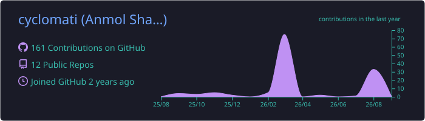
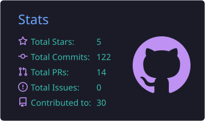
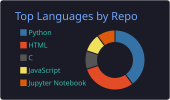
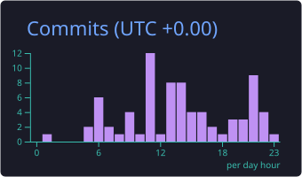
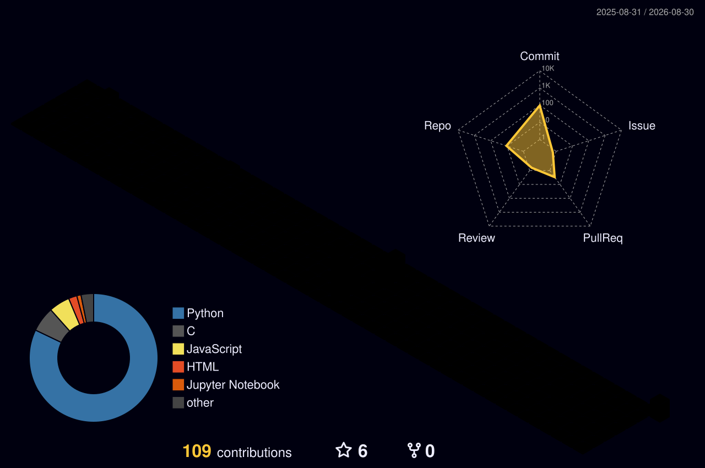

# Hi, I'm Anmol Sharma 👋

## 🏆 Open-source contributions

  
  
  
  

**Merged**

| Project | PR | What it does |
|---|---|---|
| [pymobiledevice3](https://github.com/doronz88/pymobiledevice3) — pure-Python iOS device toolkit | [#1893](https://github.com/doronz88/pymobiledevice3/pull/1893) | Added a `/connect` WebSocket endpoint to `tunneld` that bridges clients into device tunnels over the HTTP API, so tools on another host or network stack can reach tunnel services |
| [pymobiledevice3](https://github.com/doronz88/pymobiledevice3) | [#1891](https://github.com/doronz88/pymobiledevice3/pull/1891) | XDG Base Directory support on Linux — backward-compatible with existing installs, with sudo-safe ownership of created directories |
| [es-toolkit](https://github.com/toss/es-toolkit) — modern JavaScript utility library | [#2073](https://github.com/toss/es-toolkit/pull/2073) | Refreshed the published performance benchmarks for es-toolkit 1.52.0 |

**In review**

- [eslint-react #1945](https://github.com/Rel1cx/eslint-react/pull/1945) — fixes a `set-state-in-effect` false positive when an effect calls a function received via props
- [ComfyUI_frontend #16303](https://github.com/Comfy-Org/ComfyUI_frontend/pull/16303) — "Go to Node by ID" canvas navigation command
- [Sphinx #14661](https://github.com/sphinx-doc/sphinx/pull/14661) — `singlehtml_embed_assets` option for fully self-contained single-file HTML output
- [Super Productivity #9820](https://github.com/super-productivity/super-productivity/pull/9820) — clear visual highlight on a task after jumping to it from search

## 🛠 Things I've built

| | |
|---|---|
| 🎹 [**Air Piano**](https://github.com/cyclomati/AIr-Piano-Interactive-AI-Powered-Musical-Instrument) | Play piano in the air — hand-tracking turned into a playable instrument (Python, computer vision) |
| 🧠 [**Validity vs. plausibility in LLMs**](https://github.com/cyclomati/disentanglement-of-logical-validity-and-plausibility-in-Ilms) | Research notebooks probing whether LLMs separate logical validity from surface plausibility |
| 🎪 [**Felicity Event System**](https://github.com/cyclomati/felicity-event-system) | Event management platform for IIIT-H's college fest (JavaScript) |
| 🐚 [**xv6 shell & networking**](https://github.com/cyclomati/shell-networking-xv6) | A Unix shell and networking primitives inside the xv6 teaching OS (C) |
| 🎞 [**Photo Slideshow App**](https://github.com/cyclomati/Photo-slideshow-App-Web-Based-Video-Creation-Platform-) | Web-based video creation from photo collections |

## 🧰 Tech I use

  
  
  
  
  
  
  
  
  
  
  

## 📊 GitHub stats

  

  
  

  
  

## 🏙 Contributions in 3D

---

📫 Find me here on GitHub — issues, PRs, and discussions all welcome.

